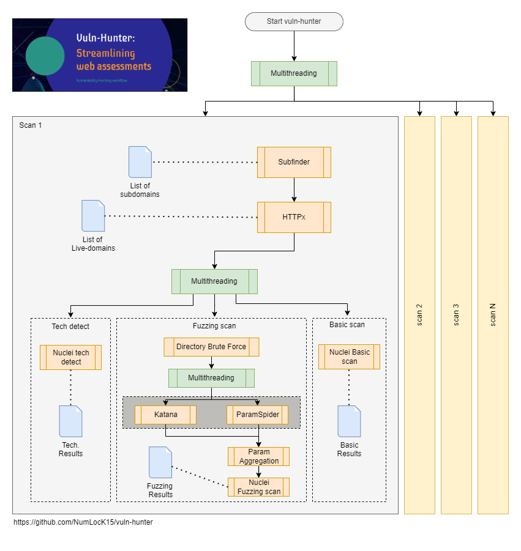

<h1 align="center">
    Vuln-Hunter
    <br>
</h1>

<h4 align="center">Streamlined Vulnerability Hunting</h4>

<p align="center">
  <a href="#about">📖 About</a> •
  <a href="#How does it work">📖 How does it work</a> •
  <a href="#installation">🏗️ Installation</a> •
  <a href="#usage">⛏️ Usage</a> •
  <a href="#examples">🚀 Examples</a> •
  <a href="#contribution">🤝 Contributing</a>
</p>


# About

Vuln-Hunter is an automated workflow that utilizes existing community tools for web assessment. It's designed to streamline the process of scanning domains and hosts for vulnerabilities and misconfigurations, making it particularly useful for bug bounty and pentesting engagements.

## Tool Choices
While there are many tools available in the community, it is crucial to choose those that can be adjusted to each assessor's preference. This is why [Nuclei](https://github.com/projectdiscovery/nuclei) by ProjectDiscovery is a top choice. Each pentester can create custom templates that fit their style using a simple YAML-based DSL.

# How Does It Work

The workflow of Vuln-Hunter is engineered to maximize efficiency by leveraging multi-threading. This approach significantly enhances the speed and effectiveness of the vulnerability hunting process. Below is an illustrative diagram demonstrating the workflow:



This diagram highlights the interconnected nature of the tools and processes within Vuln-Hunter, ensuring that each stage of the vulnerability assessment is conducted thoroughly yet swiftly. By optimizing the use of each tool, Vuln-Hunter provides a comprehensive and streamlined experience for identifying potential vulnerabilities in domains and hosts. 


## Important Notes:
- The effectiveness of scans depends on the templates used. Some community templates can be found at [Nuclei-Fuzzing Templates](https://github.com/projectdiscovery/fuzzing-templates). However, it is often better to create your own to fit your style.
- Subfinder is highly effective, especially when augmented with additional sources (API keys), such as SecurityTrails.
- The workflow enables multi-threading for higher efficiency. Please choose the number of threads wisely.

# Installation

Before using Vuln-Hunter, ensure the following tools are installed on your system:

- [Nuclei](https://github.com/projectdiscovery/nuclei)
- [Katana](https://github.com/projectdiscovery/katana)
- [Subfinder](https://github.com/projectdiscovery/subfinder)
- [ParamSpider](https://github.com/devanshbatham/ParamSpider)
- [httpx](https://github.com/projectdiscovery/httpx)

Install these dependencies with the following commands:

```bash
go install -v github.com/projectdiscovery/nuclei/v2/cmd/nuclei@latest
git clone https://github.com/projectdiscovery/fuzzing-templates.git
mv fuzzing-templates $HOME/.local/nuclei-templates/
go install github.com/projectdiscovery/katana/cmd/katana@latest
go install -v github.com/projectdiscovery/subfinder/v2/cmd/subfinder@latest
git clone https://github.com/devanshbatham/paramspider
cd paramspider && pip install .

#NOTE: Ensure your Go bin directory is included in your system's PATH. If it's not already set, temporarily add it with:
export PATH=$PATH:$HOME/go/bin
```
# Usage

To use Vuln-Hunter, run the script with the desired options. Below is the table of options for easy reference:

| Option                | Description                                                         |
| --------------------- | ------------------------------------------------------------------- |
| `-d, --domain`        | Specify a single domain for scanning.                               |
| `-l, --domain_list`   | Specify a file containing a list of domains (one per line).         |
| `--fuzzing`           | Perform Nuclei fuzzing scan.                                        |
| `--complete`          | Perform both basic and fuzzing scans.                               |
| `--paramspider`       | Use ParamSpider for parameterized URL discovery (default is Katana).|
| `--nobasic`           | Disable Nuclei basic scan.                                          |
| `-cs, --concurrentscans` | Specify the number of concurrent scans (default is 2).              |
| `-t, --timeout`       | Set a timeout for each scan in minutes (default is 30 minutes).     |
| `--silent`            | Run scans in silent mode.                                           |
| `--techdetect`        | Run a technology detection scan on the target.                      |
| `--allparams`         | Use both Katana and ParamSpider for URL extraction and merging.     |

Example usage:

```bash
python vuln-hunter.py [options]
```
# Examples

These examples showcase the versatility of Vuln-Hunter and how it can be utilized for various scanning scenarios:

1- Scan a single domain with a basic scan (no fuzzing or tech-detect):
``` bash
python vuln-Hunter.py -d example.com
```
2- Scan multiple domains from a file with fuzzing scan only (no basic):
``` bash
python vuln-Hunter.py -l domains.txt --fuzzing
```
3- Run scans in silent mode for a single domain with a timeout of 15 minutes:
``` bash
python vuln-Hunter.py -d example.com --silent -t 15
```
4- Run a complete scan with technology detection:
``` bash
python vuln-Hunter.py -d example.com --complete --techdetect
```
5- Using both Katana and ParamSpider for URL extraction:
``` bash
python vuln-Hunter.py -d example.com --fuzzing --allparams
```
6- Comprehensive scanning of a list of domains with techdetect, fuzzing, basic scans, and simultaneous usage of ParamSpider and Katana (Warning: This can be time-consuming):
``` bash
python vuln-Hunter.py -l domains.txt --complete --allparams --techdetect -cs 4 -t 15
```
7- Perform a basic scan with a custom number of concurrent scans:
``` bash
python vuln-Hunter.py -l domains.txt -cs 5
```
8- Run a silent, fuzzing-only scan for a list of domains with extended timeout:
``` bash
python vuln-Hunter.py -l domains.txt --fuzzing --silent -t 60
```
9- Execute a basic scan with technology detection on a single domain:
``` bash
python vuln-Hunter.py -d example.com --nobasic --techdetect
```
10- Run a full scan (basic, fuzzing, tech-detect) on a single domain with a custom timeout:
``` bash
python vuln-Hunter.py -d example.com --complete -t 20
```

# Contributing

Vuln-Hunter is a synthesis of several powerful tools developed by the cybersecurity community. The efficacy and utility of Vuln-Hunter are a testament to the ingenuity and hard work of the developers behind these individual tools. It's highly encouraged to visit their repositories to understand the depth of their contributions:

- [Nuclei](https://github.com/projectdiscovery/nuclei)
- [Katana](https://github.com/projectdiscovery/katana)
- [Subfinder](https://github.com/projectdiscovery/subfinder)
- [ParamSpider](https://github.com/devanshbatham/ParamSpider)
- [httpx](https://github.com/projectdiscovery/httpx)

This workflow is developed solely by myself as a contribution to the cybersecurity community. If you wish to contribute, enhance, or fork the project for your purposes, you are more than welcome to do so. Any contributions that improve the tool or extend its capabilities are greatly appreciated. 

Feel free to raise issues, submit pull requests, or suggest new features. Let's work together to make the cybersecurity space more robust and accessible to everyone. 

Let's hunt vulnerabilities smarter, not harder! 🚀

